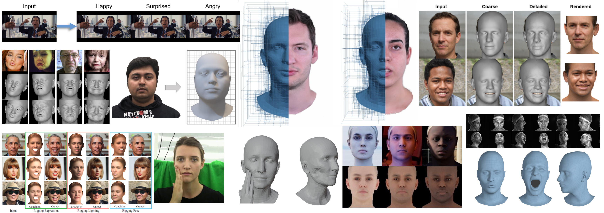

<h1 align="center">:fire: FLAME Universe :fire:</h1>

This repository presents a list of publicly available ressources such as code, datasets, and scientific papers for the :fire: [FLAME](https://flame.is.tue.mpg.de/) :fire: 3D head model.
We aim at keeping the list up to date. You are invited to add missing FLAME-based ressources (publications, code repositories, datasets) either in the discussions or in a pull request.

  
 
  
  

<h2 align="center">:fire: FLAME :fire:</h2>

Never heard of FLAME?

 

FLAME is a lightweight and expressive generic head model learned from over 33,000 of accurately aligned 3D scans. 
FLAME combines a linear identity shape space (trained from head scans of 3800 subjects) with an articulated neck, jaw, and eyeballs, pose-dependent corrective blendshapes, and additional global expression blendshapes. 
For details please see the [scientific publication](https://ps.is.tuebingen.mpg.de/uploads_file/attachment/attachment/400/paper.pdf).

To download the FLAME model, sign up under [MPI-IS/FLAME](https://flame.is.tue.mpg.de/download.php) and agree to the [model license](https://flame.is.tue.mpg.de/modellicense.html). Then you can download FLAME and other FLAME-related resources such as landmark embeddings, segmentation masks, quad template mesh, etc., from [MPI-IS/FLAME/download](https://flame.is.tue.mpg.de/download.php). 
You can also download the model with a bash script such as [fetch_FLAME](https://github.com/Rubikplayer/flame-fitting/blob/master/fetch_FLAME.sh).

<h2 align="center">Code</h2>

List of public repositories that use FLAME (alphabetical order).

- [BFM_to_FLAME](https://github.com/TimoBolkart/BFM_to_FLAME): Conversion from Basel Face Model (BFM) to FLAME.
- [CVTHead](https://github.com/HowieMa/CVTHead): Controllable head avatar generation from a single image.
- [DECA](https://github.com/YadiraF/DECA):  Reconstruction of 3D faces with animatable facial expression detail from a single image.
- [DiffPoseTalk](https://github.com/DiffPoseTalk/DiffPoseTalk): Speech-driven stylistic 3D facial animation.
- [diffusion-rig](https://github.com/adobe-research/diffusion-rig): Personalized model to edit facial expressions, head pose, and lighting in portrait images.
- [EMOCA](https://github.com/radekd91/emoca): Reconstruction of emotional 3D faces from a single image.
- [EMOTE](https://github.com/radekd91/inferno/tree/release/EMOTE/inferno_apps/TalkingHead): Emotional speech-driven 3D face animation.
- [expgan](https://github.com/kakaobrain/expgan): Face image generation with expression control.
- [FaceFormer](https://github.com/EvelynFan/FaceFormer): Speech-driven facial animation of meshes in FLAME mesh topology.
- [FateAvatar](https://github.com/zjwfufu/FateAvatar): Full-head Gaussian Avatar with Textural Editing from Monocular Video.
- [FLAME-Blender-Add-on](https://github.com/TimoBolkart/FLAME-Blender-Add-on): FLAME Blender Add-on.
- [flame-fitting](https://github.com/Rubikplayer/flame-fitting): Fitting of FLAME to scans.
- [flame-head-tracker](https://github.com/PeizhiYan/flame-head-tracker): FLAMe-based monocular video tracking.
- [FLAME_PyTorch](https://github.com/soubhiksanyal/FLAME_PyTorch): FLAME PyTorch layer.
- [GANHead](https://github.com/wsj-sjtu/GANHead): Animatable neural head avatar.
- [GAGAvatar](https://github.com/xg-chu/GAGAvatar): Recontruction of controllable 3D head avatars from a single image.
- [GaussianAvatars](https://github.com/ShenhanQian/GaussianAvatars): Photorealistic head avatars with FLAME-rigged 3D Gaussians.
- [GPAvatar](https://github.com/xg-chu/GPAvatar): Prediction of controllable 3D head avatars from one or several images.
- [GIF](https://github.com/ParthaEth/GIF): Generating face images with FLAME parameter control. 
- [INSTA](https://github.com/Zielon/INSTA): Volumetric head avatars from videos in less than 10 minutes. 
- [INSTA-pytorch](https://github.com/Zielon/INSTA-pytorch): Volumetric head avatars from videos in less than 10 minutes (PyTorch).
- [learning2listen](https://github.com/evonneng/learning2listen): Modeling interactional communication in dyadic conversations.
- [LightAvatar-TensorFlow](https://github.com/MingSun-Tse/LightAvatar-TensorFlow): Use of neural light field (NeLF) to build photorealistic 3D head avatars.
- [MICA](https://github.com/Zielon/MICA): Reconstruction of metrically accurated 3D faces from a single image.
- [MeGA](https://github.com/conallwang/MeGA): Reconstruction of an editable hybrid mesh-Gaussian head avatar.
- [metrical-tracker](https://github.com/Zielon/metrical-tracker): Metrical face tracker for monocular videos.
- [MultiTalk](https://github.com/postech-ami/MultiTalk): Speech-driven facial animation of meshes in FLAME mesh topology.
- [NED](https://github.com/foivospar/NED): Facial expression of emotion manipulation in videos.
- [Next3D](https://github.com/MrTornado24/Next3D): 3D generative model with FLAME parameter control.
- [NeuralHaircut](https://github.com/SamsungLabs/NeuralHaircut): Creation of strand-based hairstyle from single-view or multi-view videos. 
- [neural-head-avatars](https://github.com/philgras/neural-head-avatars): Building a neural head avatar from video sequences.
- [NeRSemble](https://github.com/tobias-kirschstein/nersemble): Building a neural head avatar from multi-view video data.
- [photometric_optimization](https://github.com/HavenFeng/photometric_optimization): Fitting of FLAME to images using differentiable rendering.- 
- [RGBAvatar](https://github.com/gapszju/RGBAvatar): Reduced Gaussian Blendshapes for Online Modeling of Head Avatars.
- [RingNet](https://github.com/soubhiksanyal/RingNet): Reconstruction of 3D faces from a single image. 
- [ROME](https://github.com/SamsungLabs/rome): Creation of personalized avatar from a single image.
- [SAFA](https://github.com/Qiulin-W/SAFA): Animation of face images.
- [Semantify](https://github.com/Omergral/Semantify): Semantic control over 3DMM parameters.
- [SPARK](https://github.com/KelianB/SPARK): Personalized Real-time Monocular Face Capture
- [SPECTRE](https://github.com/filby89/spectre): Speech-aware 3D face reconstruction from images.
- [SplattingAvatar](https://github.com/initialneil/SplattingAvatar): Real-time human avatars with mesh-embedded Gaussian splatting.
- [SMIRK](https://github.com/georgeretsi/smirk): Reconstruction of emotional 3D faces from a single image.
- [TRUST](https://github.com/HavenFeng/TRUST): Racially unbiased skin tone extimation from images.
- [TF_FLAME](https://github.com/TimoBolkart/TF_FLAME): Fit FLAME to 2D/3D landmarks, FLAME meshes, or sample textured meshes. 
- [video-head-tracker](https://github.com/philgras/video-head-tracker): Track 3D heads in video sequences. 
- [VOCA](https://github.com/TimoBolkart/voca): Speech-driven facial animation of meshes in FLAME mesh topology.
- [VHAP](https://github.com/ShenhanQian/VHAP): 3D face tracker for single-view and multi-view videos.

<h2 align="center">Datasets</h2>

List of datasets with meshes in FLAME topology. 

- [BP4D+](https://github.com/Zielon/MICA/tree/master/datasets): 127 subjects, one neutral expression mesh each. 
- [CoMA dataset](https://coma.is.tue.mpg.de/download.php): 12 subjects, 12 extreme dynamic expressions each.
- [D3DFACS](https://flame.is.tue.mpg.de/download.php): 10 subjects, 519 dynamic expressions in total.
- [Decaf dataset](https://github.com/soshishimada/DecafDatasetScript): Deformation capture for face and hand interactions.
- [FaceWarehouse](http://kunzhou.net/zjugaps/facewarehouse/): 150 subjects, one neutral expression mesh each. 
- [FaMoS](https://tempeh.is.tue.mpg.de/): 95 subjects, 28 dynamic expressions and head poses each, about 600K frames in total.
- [Florence 2D/3D](https://github.com/Zielon/MICA/tree/master/datasets): 53 subjects, one neutral expression mesh each. 
- [FRGC](https://github.com/Zielon/MICA/tree/master/datasets): 531 subjects, one neutral expression mesh each. 
- [LYHM](https://www-users.cs.york.ac.uk/~nep/research/Headspace/): 1216 subjects, one neutral expression mesh each.
- [MEAD reconstructions](https://github.com/radekd91/inferno/tree/release/EMOTE/inferno_apps/TalkingHead): 3D face reconstructions for MEAD (emotional talking-face dataset).
- [MEAD-3D](https://github.com/haonanhe/MEAD-3D): FLAME meshes and model parameters for MEAD.
- [NeRSemble dataset](https://github.com/tobias-kirschstein/nersemble): 10 sequences of multi-view images and 3D faces in FLAME mesh topology.
- [RenderMe-360](https://github.com/RenderMe-360/RenderMe-360): Digital asset library for high-fidelity head avatars with labeled FLAME parameters.
- [SingingHead](https://github.com/wsj-sjtu/SingingHead):  27 hours of synchronized singing video, audio, 3D facial motion, and background music from 76 subjects.
- [Stirling](https://github.com/Zielon/MICA/tree/master/datasets): 133 subjects, one neutral expression mesh each. 
- [VOCASET](https://github.com/TimoBolkart/voca): 12 subjects, 40 speech sequences each with synchronized audio.

<h2 align="center">Publications</h2>

List of FLAME-based scientific publications.

#### 2025

- [GRMM: Real-Time High-Fidelity Gaussian Morphable Head Model with Learned Residuals](https://arxiv.org/pdf/2509.02141).
- [FastAvatar: Towards Unified Fast High-Fidelity 3D Avatar Reconstruction with Large Gaussian Reconstruction Transformers](https://arxiv.org/pdf/2508.19754).
- [OT-Talk: Animating 3D Talking Head with Optimal Transportation](https://arxiv.org/pdf/2505.01932).
- [SEGA: Drivable 3D Gaussian Head Avatar from a Single Image](https://arxiv.org/pdf/2504.14373).
- [ARTalk: Speech-Driven 3D Head Animation via Autoregressive Model](https://arxiv.org/pdf/2502.20323)
- [TEASER: Token Enhanced Spatial Modeling For Expressions Reconstruction](https://arxiv.org/pdf/2502.10982).
- [PrismAvatar: Real-time animated 3D neural head avatars on edge devices](https://arxiv.org/pdf/2502.07030).
- [TalkingEyes: Pluralistic Speech-Driven 3D Eye Gaze Animation](https://arxiv.org/pdf/2501.09921).
- [MeGA: Hybrid Mesh-Gaussian Head Avatar for High-Fidelity Rendering and Head Editing (CVPR 2025)](https://arxiv.org/pdf/2404.19026).
- [Data Synthesis with Diverse Styles for Face Recognition via 3DMM-Guided Diffusion (CVPR 2025)](https://arxiv.org/pdf/2504.00430).
- [3D Gaussian Head Avatars with Expressive Dynamic Appearances by Compact Tensorial Representations (CVPR 2025)](https://arxiv.org/pdf/2504.14967).
- [Perceptually Accurate 3D Talking Head Generation: New Definitions, Speech-Mesh Representation, and Evaluation Metrics (CVPR 2025)](https://arxiv.org/pdf/2503.20308).
- [DualTalk: Dual-Speaker Interaction for 3D Talking Head Conversations (CVPR 2025)](https://arxiv.org/pdf/2505.18096).
- [Arc2Avatar: Generating Expressive 3D Avatars from a Single Image via ID Guidance (CVPR 2025)](https://arxiv.org/pdf/2501.05379).
- [RGBAvatar: Reduced Gaussian Blendshapes for Online Modeling of Head Avatars (CVPR 2025)](https://arxiv.org/pdf/2503.12886).
- [Coherent 3D Portrait Video Reconstruction via Triplane Fusion (CVPR 2025)](https://arxiv.org/pdf/2412.08684).
- [ControlFace: Harnessing Facial Parametric Control for Face Rigging (CVPR 2025)](https://arxiv.org/pdf/2412.01160).
- [GAF: Gaussian Avatar Reconstruction from Monocular Videos via Multi-view Diffusion (CVPR 2025)](https://arxiv.org/pdf/2412.10209).
- [GPAvatar: High-fidelity Head Avatars by Learning Efficient Gaussian Projections (CVPR 2025)](https://openaccess.thecvf.com/content/CVPR2025/papers/Feng_GPAvatar_High-fidelity_Head_Avatars_by_Learning_Efficient_Gaussian_Projections_CVPR_2025_paper.pdf).
- [FATE: Full-head Gaussian Avatar with Textural Editing from Monocular Video (CVPR 2025)](https://arxiv.org/pdf/2411.15604).
- [Gaussian Eigen Models for Human Heads (CVPR 2025)](https://arxiv.org/pdf/2407.04545).
- [Electromyography-Informed Facial Expression Reconstruction for Physiological-Based Synthesis and Analysis (CVPR 2025)](https://arxiv.org/pdf/2503.09556).
- [CAP4D: Creating Animatable 4D Portrait Avatars with Morphable Multi-View Diffusion Models (CVPR 2025)](https://arxiv.org/pdf/2412.12093).
- [OFER: Occluded Face Expression Reconstruction (CVPR 2025)](https://arxiv.org/pdf/2410.21629).
- [Gaussian Déjà-vu: Creating Controllable 3D Gaussian Head-Avatars with Enhanced Generalization and Personalization Abilities (WACV 2025)](https://arxiv.org/pdf/2409.16147).

#### 2024

- [GaussianHair: Hair Modeling and Rendering with Light-aware Gaussians](https://arxiv.org/pdf/2402.10483).
- [FATE: Full-head Gaussian Avatar with Textural Editing from Monocular Video](https://arxiv.org/pdf/2411.15604).
- [SurFhead: Affine Rig Blending for Geometrically Accurate 2D Gaussian Surfel Head Avatars](https://arxiv.org/pdf/2410.11682).
- [MixedGaussianAvatar: Realistically and Geometrically Accurate Head Avatar via Mixed 2D-3D Gaussian Splatting](https://arxiv.org/pdf/2412.04955).
- [GaussianSpeech: Audio-Driven Gaussian Avatars](https://arxiv.org/pdf/2411.18675).
- [GaussianHeads: End-to-End Learning of Drivable Gaussian Head Avatars from Coarse-to-fine Representations](https://arxiv.org/pdf/2409.11951).
- [VGG-Tex: A Vivid Geometry-Guided Facial Texture Estimation Model for High Fidelity Monocular 3D Face Reconstruction](https://arxiv.org/pdf/2409.09740).
- [DEEPTalk: Dynamic Emotion Embedding for Probabilistic Speech-Driven 3D Face Animation](https://arxiv.org/pdf/2408.06010).
- [FAGhead: Fully Animate Gaussian Head from Monocular Videos](https://arxiv.org/pdf/2406.19070).
- [Rig3DGS: Creating Controllable Portraits from Casual Monocular Videos](https://arxiv.org/pdf/2402.03723.pdf).
- [ProbTalk3D: Non-Deterministic Emotion Controllable Speech-Driven 3D Facial Animation Synthesis Using VQ-VAE (SIGGRAPH MIG 2024)](https://arxiv.org/pdf/2409.07966).
- [GGHead: Fast and Generalizable 3D Gaussian Heads (SIGGRAPH Asia 2024)](https://arxiv.org/pdf/2406.09377).- 
- [Generalizable and Animatable Gaussian Head Avatar (NeurIPS 2024)](https://arxiv.org/pdf/2410.07971).
- [SPARK: Self-supervised Personalized Real-time Monocular Face Capture (SIGGRAPH Asia 2024)](https://arxiv.org/pdf/2409.07984).
- [MultiTalk: Enhancing 3D Talking Head Generation Across Languages with Multilingual Video Dataset (INTERSPEECH 2024)](https://arxiv.org/pdf/2406.14272).
- [GPAvatar: Generalizable and Precise Head Avatars from Image(S) (ICLR 2024)](https://arxiv.org/pdf/2401.10215).
- [LightAvatar: Efficient Head Avatar as Dynamic Neural Light Field (ECCV-W 2024)](https://arxiv.org/pdf/2409.18057).
- [Stable Video Portraits (ECCV 2024)](https://arxiv.org/pdf/2409.18083).
- [GRAPE: Generalizable and Robust Multi-view Facial Capture (ECCV 2024](https://arxiv.org/pdf/2407.10193).
- [Human Hair Reconstruction with Strand-Aligned 3D Gaussians (ECCV 2024)](https://arxiv.org/pdf/2409.14778).
- [PAV: Personalized Head Avatar from Unstructured Video Collection (ECCV 2024)](https://arxiv.org/pdf/2407.21047).
- [GAUSSIAN3DIFF: 3D Gaussian Diffusion for 3D Full Head Synthesis and Editing (ECCV 2024)](https://arxiv.org/pdf/2312.03763.pdf).
- [MeGA: Hybrid Mesh-Gaussian Head Avatar for High-Fidelity Rendering and Head Editing (ECCV 2024)](https://arxiv.org/pdf/2404.19026).
- [HeadGaS: Real-Time Animatable Head Avatars via 3D Gaussian Splatting (ECCV 2024)](https://arxiv.org/pdf/2312.02902).
- [HeadStudio: Text to Animatable Head Avatars with 3D Gaussian Splatting (ECCV 2024)](https://arxiv.org/pdf/2402.06149).
- [3D Gaussian Blendshapes for Head Avatar Animation (SIGGRAPH 2024)](https://arxiv.org/pdf/2404.19398).
- [MonoGaussianAvatar: Monocular Gaussian Point-based Head Avatar (SIGGRAPH 2024)](https://arxiv.org/pdf/2312.04558).
- [DiffPoseTalk: Speech-Driven Stylistic 3D Facial Animation and Head Pose Generation via Diffusion Models (SIGGRAPH 2024)](https://browse.arxiv.org/pdf/2310.00434.pdf).
- [EMAGE: Towards Unified Holistic Co-Speech Gesture Generation via Expressive Masked Audio Gesture Modeling (CVPR 2024)](https://arxiv.org/pdf/2401.00374).
- [UltrAvatar: A Realistic Animatable 3D Avatar Diffusion Model with Authenticity Guided Textures (CVPR 2024)](https://arxiv.org/pdf/2401.11078).
- [FlashAvatar: High-fidelity Head Avatar with Efficient Gaussian Embedding (CVPR 2024)](https://arxiv.org/pdf/2312.02214).
- [Portrait4D: Learning One-Shot 4D Head Avatar Synthesis using Synthetic Data (CVPR 2024)](https://arxiv.org/pdf/2311.18729).
- [SplattingAvatar: Realistic Real-Time Human Avatars with Mesh-Embedded Gaussian Splatting (CVPR 2024)](https://arxiv.org/pdf/2403.05087).
- [3D Facial Expressions through Analysis-by-Neural-Synthesis (CVPR 2024)](https://arxiv.org/pdf/2404.04104.pdf).
- [GaussianAvatars: Photorealistic Head Avatars with Rigged 3D Gaussians (CVPR 2024)](https://arxiv.org/pdf/2312.02069.pdf).
- [FaceComposer: A Unified Model for Versatile Facial Content Creation (NeurIPS 2023)](https://proceedings.neurips.cc/paper_files/paper/2023/file/2b4caf39e645680f826ae0a9e7ae9402-Paper-Conference.pdf).
- [Feel the Bite: Robot-Assisted Inside-Mouth Bite Transfer using Robust Mouth Perception and Physical Interaction-Aware Control (HRI 2024)](https://dl.acm.org/doi/pdf/10.1145/3610977.3634975).
- [ReliTalk: Relightable Talking Portrait Generation from a Single Video (IJCV 2024)](https://arxiv.org/pdf/2309.02434.pdf).
- [Audio-Driven Speech Animation with Text-Guided Expression (EG 2024)](https://diglib.eg.org/server/api/core/bitstreams/4fbd525f-ea74-4a0b-9e21-d8c2003fde2a/content).
- [CVTHead: One-shot Controllable Head Avatar with Vertex-feature Transformer (WACV 2024)](https://openaccess.thecvf.com/content/WACV2024/papers/Ma_CVTHead_One-Shot_Controllable_Head_Avatar_With_Vertex-Feature_Transformer_WACV_2024_paper.pdf).
- [AU-Aware Dynamic 3D Face Reconstruction from Videos with Transformer (WACV 2024)](https://openaccess.thecvf.com/content/WACV2024/papers/Kuang_AU-Aware_Dynamic_3D_Face_Reconstruction_From_Videos_With_Transformer_WACV_2024_paper.pdf).
- [Towards Realistic Generative 3D Face Models (WACV 2024)](https://arxiv.org/pdf/2304.12483.pdf).
- [LaughTalk: Expressive 3D Talking Head Generation with Laughter (WACV 2024)](https://arxiv.org/pdf/2311.00994.pdf).
- [NeRFlame: FLAME-based conditioning of NeRF for 3D face rendering (ICCS 2024)](https://arxiv.org/pdf/2303.06226.pdf).

#### 2023

- [A Large-Scale 3D Face Mesh Video Dataset via Neural Re-parameterized Optimization](https://arxiv.org/pdf/2310.03205).
- [DF-3DFace: One-to-Many Speech Synchronized 3D Face Animation with Diffusion](https://arxiv.org/pdf/2310.05934.pdf)
- [HeadCraft: Modeling High-Detail Shape Variations for Animated 3DMMs](https://arxiv.org/pdf/2312.14140.pdf).
- [3DiFACE: Diffusion-based Speech-driven 3D Facial Animation and Editing](https://arxiv.org/pdf/2312.00870.pdf).
- [Articulated 3D Head Avatar Generation using Text-to-Image Diffusion Models](https://arxiv.org/pdf/2307.04859.pdf).
- [Fake It Without Making It: Conditioned Face Generation for Accurate 3D Face](https://arxiv.org/pdf/2307.13639.pdf).
- [Text2Face: A Multi-Modal 3D Face Model](https://arxiv.org/pdf/2303.02688.pdf).
- [SelfTalk: A Self-Supervised Commutative Training Diagram to Comprehend 3D Talking Faces (ACM-MM 2023)](https://arxiv.org/pdf/2306.10799.pdf).
- [Expressive Speech-driven Facial Animation with controllable emotions (ICMEW 2023)](https://arxiv.org/pdf/2301.02008.pdf).
- [A Perceptual Shape Loss for Monocular 3D Face Reconstruction (Pacific Graphics 2023)](https://studios.disneyresearch.com/app/uploads/2023/09/A-Perceptual-Shape-Loss-for-Monocular-3D-Face-Reconstruction-Paper.pdf).
- [FLARE: Fast Learning of Animatable and Relightable Mesh Avatars (SIGGRAPH Asia 2023)](https://drive.google.com/file/d/1iiON_x9d2E4erP2n-2A4JQ-piHr5kdQ3/view?pli=1).
- [Emotional Speech-Driven Animation with Content-Emotion Disentanglement (SIGGRAPH Asia 2023)](https://arxiv.org/pdf/2306.08990.pdf).
- [Decaf: Monocular Deformation Capture for Face and Hand Interactions (SIGGRAPH Asia 2023)](https://vcai.mpi-inf.mpg.de/projects/Decaf/static/paper.pdf).
- [Neural Haircut: Prior-Guided Strand-Based Hair Reconstruction (ICCV 2023)](https://arxiv.org/pdf/2306.05872).
- [Can Language Models Learn to Listen? (ICCV 2023)](https://arxiv.org/pdf/2308.10897.pdf).
- [Accurate 3D Face Reconstruction with Facial Component Tokens (ICCV 2023)](https://openaccess.thecvf.com/content/ICCV2023/papers/Zhang_Accurate_3D_Face_Reconstruction_with_Facial_Component_Tokens_ICCV_2023_paper.pdf)
- [Speech4Mesh: Speech-Assisted Monocular 3D Facial Reconstruction for Speech-Driven 3D Facial Animation (ICCV 2023)](https://openaccess.thecvf.com/content/ICCV2023/papers/He_Speech4Mesh_Speech-Assisted_Monocular_3D_Facial_Reconstruction_for_Speech-Driven_3D_Facial_ICCV_2023_paper.pdf).
- [Semantify: Simplifying the Control of 3D Morphable Models using CLIP (ICCV 2023)](https://arxiv.org/pdf/2308.07415.pdf).
- [Imitator: Personalized Speech-driven 3D Facial Animation (ICCV 2023)](https://arxiv.org/pdf/2301.00023.pdf).
- [NeRSemble: Multi-view Radiance Field Reconstruction of Human Heads (SIGGRAPH 2023)](https://arxiv.org/pdf/2305.03027.pdf).
- [ClipFace: Text-guided Editing of Textured 3D Morphable Models (SIGGRAPH 2023)](https://arxiv.org/pdf/2212.01406.pdf).
- [GANHead: Towards Generative Animatable Neural Head Avatars (CVPR 2023)](https://openaccess.thecvf.com/content/CVPR2023/papers/Wu_GANHead_Towards_Generative_Animatable_Neural_Head_Avatars_CVPR_2023_paper.pdf).
- [Implicit Neural Head Synthesis via Controllable Local Deformation Fields (CVPR 2023)](https://arxiv.org/pdf/2304.11113.pdf).
- [DiffusionRig: Learning Personalized Priors for Facial Appearance Editing (CVPR 2023)](https://arxiv.org/pdf/2304.06711.pdf).
- [High-Res Facial Appearance Capture from Polarized Smartphone Images (CVPR 2023)](https://arxiv.org/pdf/2212.01160.pdf).
- [Instant Volumetric Head Avatars (CVPR 2023)](https://arxiv.org/pdf/2211.12499.pdf).
- [Learning Personalized High Quality Volumetric Head Avatars (CVPR 2023)](https://arxiv.org/pdf/2304.01436.pdf).
- [Next3D: Generative Neural Texture Rasterization for 3D-Aware Head Avatars (CVPR 2023)](https://arxiv.org/pdf/2211.11208.pdf).
- [PointAvatar: Deformable Point-based Head Avatars from Videos (CVPR 2023)](https://arxiv.org/pdf/2212.08377.pdf).
- [Visual Speech-Aware Perceptual 3D Facial Expression Reconstruction from Videos (CVPR-W 2023)](https://arxiv.org/pdf/2207.11094.pdf).
- [Scaling Neural Face Synthesis to High FPS and Low Latency by Neural Caching (WACV 2023)](https://arxiv.org/pdf/2211.05773.pdf).
  
#### 2022

- [TeleViewDemo: Experience the Future of 3D Teleconferencing (SIGGRAPH Asia 2022)](https://dl.acm.org/doi/fullHtml/10.1145/3550472.3558404).
- [Realistic One-shot Mesh-based Head Avatars (ECCV 2022)](https://arxiv.org/pdf/2206.08343.pdf).
- [Towards Metrical Reconstruction of Human Faces (ECCV 2022)](https://arxiv.org/pdf/2204.06607.pdf).
- [Towards Racially Unbiased Skin Tone Estimation via Scene Disambiguation (ECCV 2022)](https://arxiv.org/pdf/2205.03962.pdf).
- [Generative Neural Articulated Radiance Fields (NeurIPS 2022)](https://arxiv.org/pdf/2206.14314.pdf).
- [EMOCA: Emotion Driven Monocular Face Capture and Animation (CVPR 2022)](https://arxiv.org/pdf/2204.11312.pdf).
- [Generating Diverse 3D Reconstructions from a Single Occluded Face Image (CVPR 2022)](https://arxiv.org/pdf/2112.00879.pdf).
- [I M Avatar: Implicit Morphable Head Avatars from Videos (CVPR 2022)](https://arxiv.org/pdf/2112.07471.pdf).
- [Learning to Listen: Modeling Non-Deterministic Dyadic Facial Motion (CVPR 2022)](https://arxiv.org/pdf/2204.08451.pdf).
- [Neural Emotion Director: Speech-preserving semantic control of facial expressions in “in-the-wild” videos (CVPR 2022)](https://arxiv.org/pdf/2112.00585.pdf).
- [Neural head avatars from monocular RGB videos (CVPR 2022)](https://arxiv.org/pdf/2112.01554.pdf).
- [RigNeRF: Fully Controllable Neural 3D Portraits (CVPR 2022)](https://arxiv.org/pdf/2206.06481.pdf).
- [Simulated Adversarial Testing of Face Recognition Models (CVPR 2022)](https://arxiv.org/pdf/2106.04569.pdf).
- [Accurate 3D Hand Pose Estimation for Whole-Body 3D Human Mesh Estimation (CVPR-W 2022)](https://arxiv.org/pdf/2011.11534.pdf).
- [MOST-GAN: 3D Morphable StyleGAN for Disentangled Face Image Manipulation (AAAI 2022)](https://arxiv.org/pdf/2111.01048.pdf).
- [Exp-GAN: 3D-Aware Facial Image Generation with Expression Control (ACCV 2022)](https://openaccess.thecvf.com/content/ACCV2022/papers/Lee_Exp-GAN_3D-Aware_Facial_Image_Generation_with_Expression_Control_ACCV_2022_paper.pdf).

#### 2021

- [Data-Driven 3D Neck Modeling and Animation (TVCG 2021)](http://xufeng.site/publications/2020/Data-Driven%203D%20Neck%20Modeling%20and%20Animation.pdf).
- [MorphGAN: One-Shot Face Synthesis GAN for Detecting Recognition Bias (BMVC 2021)](https://arxiv.org/pdf/2012.05225.pdf).
- [SIDER : Single-Image Neural Optimization for Facial Geometric Detail Recovery (3DV 2021)](https://arxiv.org/pdf/2108.05465.pdf).
- [SAFA: Structure Aware Face Animation (3DV 2021)](https://arxiv.org/pdf/2111.04928.pdf).
- [Learning an Animatable Detailed 3D Face Model from In-The-Wild Images (SIGGRAPH 2021)](https://arxiv.org/pdf/2012.04012.pdf).

#### 2020

- [Monocular Expressive Body Regression through Body-Driven Attention (ECCV 2020)](https://arxiv.org/pdf/2008.09062.pdf).
- [GIF: Generative Interpretable Faces (3DV 2020)](https://arxiv.org/pdf/2009.00149.pdf).

#### 2019

- [Learning to Regress 3D Face Shape and Expression from an Image without 3D Supervision (CVPR 2019)](https://arxiv.org/pdf/1905.06817.pdf).

